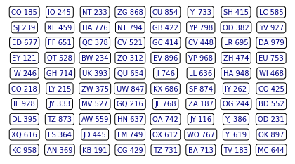

*Note: Problems adapted from Sheldon Ross's A First Course in Probability*

While I (and nearly everyone else) am stuck inside my house for social distancing, I wanted to make most of my time by learning new things. Specifically machine learning and some of the basic math behind. I'm in my last semester studying computational statistics and wanted to review some old class material by solving some problems, trying to implement them in Python, and visually show my intuition behind solving these problems.

I'm starting off this quarantine with a series of posts on probability problems. A lot of these problems will be based off of [STAT 414](https://online.stat.psu.edu/stat414/) and [Sheldon Ross's A First Course in Probability](http://julio.staff.ipb.ac.id/files/2015/02/Ross_8th_ed_English.pdf)

Let's start off with some combinatorics problems!

## License Plates

Let's say we have an empty license plate that can be 5 characters long. We want to find out how many 5 character long licenses are possible if the first 2 characters are for uppercase letters (A-Z) and the other 3 are for digits (0-9). 

 
    

First, let's solve this assuming we can allow repeats.

I like to think of these problems by looking at how many options are available at each "slot", in this case how many options there are for each spot in the license plate. Let the underscores represent the spots.

                        _ _ _ _ _

In the first two spots, we can have any two uppercase letters of which there are 26. So far we have:

                        26 26 _ _ _

And in other spots, we can have any digits. In each spot, there are 10 options.

                        26 26 10 10 10

So if we multiply all these numbers we get a final answer of 672,000.

But if we don't allow repeats. We have 26 options for the first slot and then 25 options for the second slot since one letter has been used already. For the third spot there are 10 options, for the fourth spot there are 9 options, and for the fifth spot there are 8 spots.

For an answer of 468,000 (26 x 25 x 10 x 9 x 8).

Let's try to generate these answers in Python.